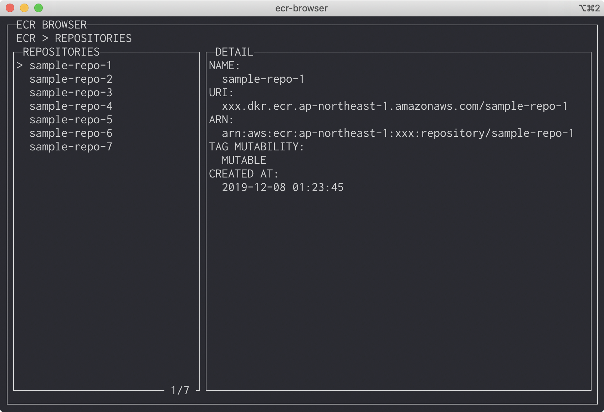
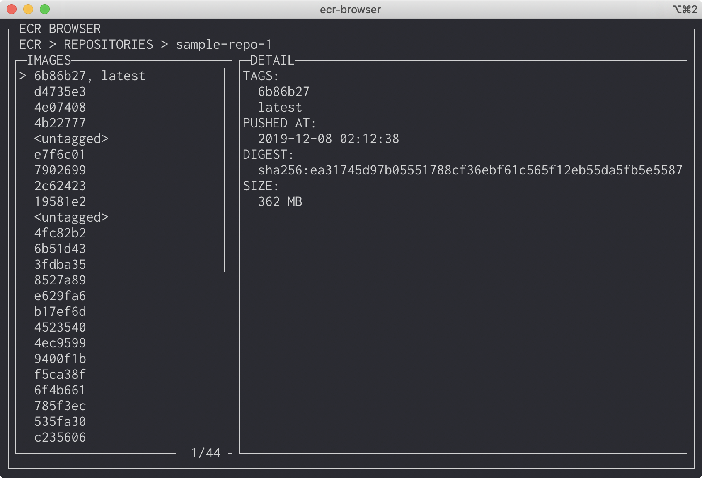

ECR Browser
====

TUI browser for AWS ECR written in Go

## Keybinding

|Key|Description|
|-|-|
|j|move up|
|k|move down|
|g|move to the top|
|G|move to the bottom|
|h|move to repository list|
|l|move to image list|
|o|open AWS management console repository page in web browser|
|q / Ctrl+C|quit|

## Screenshot

## TODO

- search list
- wrap detail
- redraw when terminal size changes
- action
  - open repository / image page on web browser
  - copy detail value to clipboard
  - sort by another key
  - reflesh image list cache 
- configuration
  - default setting file / change menu
  - aws credentials
  - aws region
